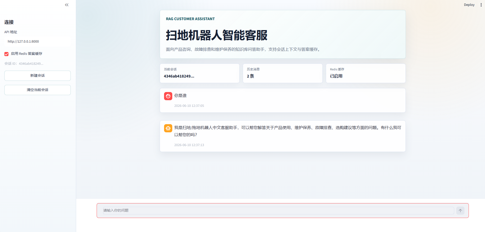
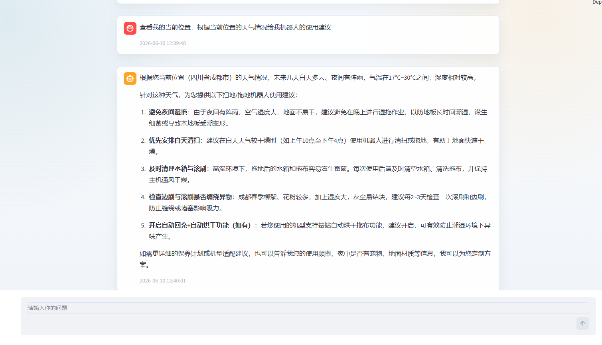
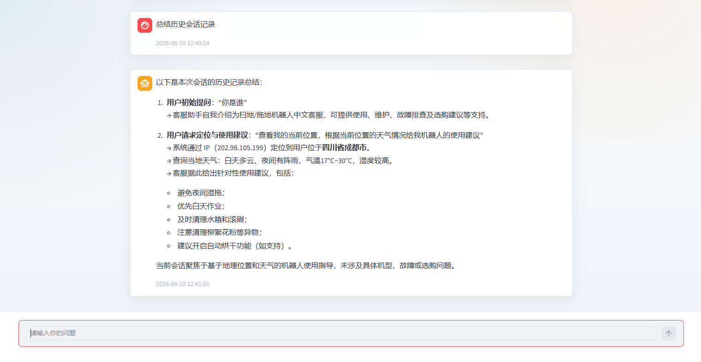
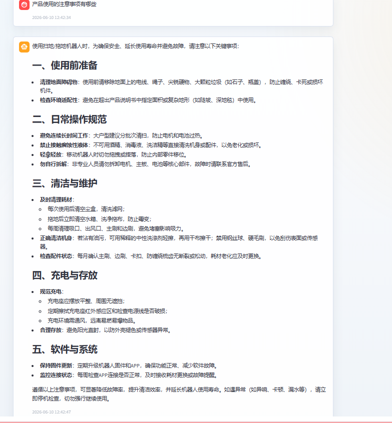

# 基于 FastAPI、Streamlit、LangGraph、Milvus、Redis、MySQL 的扫地机器人知识库问答系统

本项目支持知识库检索、问答生成、会话历史保存、Redis 答案缓存，以及可选的高德地图 MCP 定位和天气工具调用。

## 目录

- [项目截图](#项目截图)
- [功能特性](#功能特性)
- [技术栈](#技术栈)
- [技术架构深度解析](#技术架构深度解析)
- [项目结构](#项目结构)
- [快速开始](#快速开始)
- [API 接口](#api-接口)

## 项目截图

### 前端首页



### 问答示例



### 知识库回答



### 问答示例



## 功能特性

- 基于本地知识库进行扫地机器人相关问答
- 使用 BGE-M3 向量模型构建混合检索知识库
- 使用 Milvus 存储和检索向量数据
- 使用 LangGraph 编排 Agent 问答流程
- 使用 DashScope/Qwen 作为大语言模型
- 使用 MySQL 保存多轮会话历史
- 使用 Redis 缓存问答结果
- 提供 FastAPI 后端接口
- 提供 Streamlit 前端页面
- 可选接入高德地图 MCP 工具，支持定位和天气查询

## 技术栈

- Python 3.10+
- FastAPI
- Streamlit
- LangChain / LangGraph
- DashScope / Qwen
- BGE-M3 / FlagEmbedding
- Milvus
- Redis
- MySQL
- PyMySQL
- Pydantic

## 技术架构深度解析

### STEP 1 — 整体架构设计

项目采用前后端分离的轻量化架构：

- 前端使用 Streamlit 构建交互式 Web 问答界面
- 后端使用 FastAPI 提供问答、知识库、会话管理等接口
- Agent 层使用 LangGraph 编排检索、工具调用和大模型生成流程
- 数据层使用 Milvus、MySQL、Redis 分别承担向量检索、会话持久化和答案缓存
- 外部能力接入 DashScope/Qwen 大模型与高德 MCP 工具

整体流程如下：

```text
用户问题
   |
   v
Streamlit 前端
   |
   v
FastAPI 后端
   |
   v
LangGraph Agent
   |-- 知识库检索: Milvus + BGE-M3
   |-- 会话历史: MySQL
   |-- 答案缓存: Redis
   |-- 工具调用: 高德 MCP
   |
   v
DashScope/Qwen 生成回答
   |
   v
流式返回前端
```

### STEP 2 — RAG 检索增强生成

项目通过 RAG（Retrieval-Augmented Generation）提升回答的准确性和可追溯性。

- 使用 `data/` 目录中的 TXT、PDF 文档作为原始知识来源
- 通过文档加载器读取原始文本
- 使用文本切分策略将长文档拆分为适合检索的知识片段
- 使用 BGE-M3 生成 dense vector 和 sparse vector
- 将向量、原文片段、来源文件和创建时间写入 Milvus
- 用户提问时先检索相关知识片段，再交给大模型生成最终回答

### STEP 3 — LangGraph Agent 智能体

Agent 层负责决定如何回答用户问题。

- 普通产品问答优先走知识库检索
- 涉及位置、天气、本地环境的问题才调用高德 MCP 工具
- 结合系统提示词约束模型行为，避免无关工具调用
- 支持多轮会话上下文，让回答能够参考历史对话
- 最终将检索结果、会话历史和工具结果组织后交给 Qwen 生成回答

### STEP 4 — MCP 模型上下文协议集成

项目接入高德地图 MCP 工具，用于扩展 Agent 的外部能力。

- `maps_ip_location`：根据 IP 获取用户所在城市
- `maps_weather`：根据城市查询天气信息
- 仅在用户问题确实需要位置或天气信息时调用
- MCP 工具由后端统一加载，并注入到 Agent 执行流程中

### STEP 5 — Milvus 向量数据库

项目使用 Milvus 作为知识库向量数据库。

- dense vector 用于语义相似度检索
- sparse vector 用于关键词和稀疏特征匹配
- 使用混合检索提升召回效果
- 支持对检索结果进行 rerank，提高最终上下文质量
- 使用 MD5 记录已入库文档，避免重复构建知识库

### STEP 6 — Streamlit Web 界面

前端使用 Streamlit 实现快速交互。

- 提供聊天式问答界面
- 支持流式展示后端回答
- 支持会话 ID 管理
- 支持开启或关闭 Redis 答案缓存
- 与 FastAPI 后端通过 HTTP 接口通信

## 项目结构

```text
.
|-- app/                         # 后端核心代码
|   |-- __init__.py
|   |-- agent.py                  # Agent 编排与问答逻辑
|   |-- business_tools.py         # 业务工具
|   |-- config.py                 # 环境变量与配置读取
|   |-- history.py                # MySQL 会话历史管理
|   |-- knowledge_base.py         # 知识库构建与检索
|   |-- loaders.py                # TXT / PDF 文档加载
|   |-- main.py                   # FastAPI 应用入口
|   |-- mcp_client.py             # MCP 工具客户端
|   `-- redis_cache.py            # Redis 缓存
|-- frontend/
|   `-- streamlit_app.py          # Streamlit 前端入口
|-- scripts/
|   |-- init_mysql.py             # 初始化 MySQL 数据库
|   `-- build_knowledge_base.py   # 构建知识库
|-- data/                         # 原始知识库文档
|-- runtime/                      # 运行时记录
|-- .env.example                  # 环境变量示例
|-- requirements.txt              # Python 依赖
`-- README.md
```

## 快速开始

### 1. 安装依赖

```bash
pip install -r requirements.txt
```

### 2. 配置环境变量

复制示例配置：

```bash
cp .env.example .env
```

然后修改 `.env`，填写自己的配置：

```env
DASHSCOPE_API_KEY=your_dashscope_api_key_here
AMAP_MAPS_API_KEY=your_amap_maps_api_key_here

MYSQL_HOST=localhost
MYSQL_PORT=3306
MYSQL_USER=your_mysql_user_here
MYSQL_PASSWORD=your_mysql_password_here
MYSQL_DATABASE=rag_agent

REDIS_ENABLED=true
REDIS_URL=redis://localhost:6379/0

MILVUS_URI=http://localhost:19530
MILVUS_COLLECTION=agent_knowledge
```

如果暂时不使用高德地图 MCP，可以设置：

```env
MCP_ENABLED=false
```

### 3. 启动外部服务

运行项目前需要确保以下服务可用：

- MySQL
- Redis
- Milvus

### 4. 初始化 MySQL

```bash
python scripts/init_mysql.py
```

### 5. 构建知识库

```bash
python scripts/build_knowledge_base.py
```

### 6. 启动后端

```bash
uvicorn app.main:app --host 0.0.0.0 --port 8000 --reload
```

### 7. 启动前端

```bash
streamlit run frontend/streamlit_app.py
```

## API 接口

后端默认运行在：

```text
http://127.0.0.1:8000
```

常用接口：

- `GET /health`：健康检查
- `POST /chat/stream`：流式问答
- `POST /sessions/{session_id}/clear`：清空指定会话
- `POST /knowledge/documents`：手动添加知识文档
